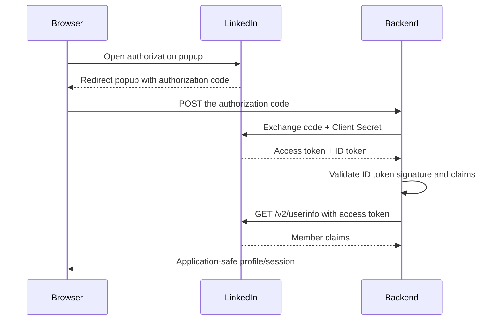

# Complete LinkedIn sign-in tutorial

This tutorial implements the complete **Sign in with LinkedIn using OpenID
Connect** flow:

1. Create and configure a LinkedIn developer application.
2. Open the LinkedIn authorization popup from React.
3. Receive an authorization code in the browser.
4. Send the code to your backend.
5. Exchange the code for an access token and ID token.
6. Validate the ID token.
7. Request the signed-in member's details from LinkedIn's UserInfo endpoint.

The example uses a React/Vite frontend at `http://localhost:5173` and a
Node.js/Express backend at `http://localhost:3001`. Adapt the file names and
routes to your framework as needed.

> [!CAUTION]
> Your LinkedIn Client ID is public and can be used in browser code. Your
> **Client Secret and LinkedIn access tokens must stay on your backend**. Never
> put the Client Secret in a `VITE_*`, `NEXT_PUBLIC_*`, or `REACT_APP_*`
> variable, commit it to source control, or return it to the browser.

## How the flow works



The package handles only the browser portion of this sequence. Your backend is
responsible for the token exchange, token validation, and LinkedIn API calls.

## Prerequisites

- A LinkedIn account.
- A LinkedIn Page to associate with your developer application if the Developer
  Portal requests one.
- A React application.
- Node.js 18 or newer for the backend example. Node.js 20 or newer is
  recommended.

## 1. Create and configure the LinkedIn application

1. Open the [LinkedIn Developer Portal](https://www.linkedin.com/developers/apps)
   and select **Create app**.
2. Complete the required application details. If prompted, associate the app
   with a LinkedIn Page and complete the Page verification process.
3. Open the app's **Products** tab.
4. Request **Sign in with LinkedIn using OpenID Connect**. Wait until the
   product is available to the app before continuing.
5. Open the **Auth** tab and copy the **Client ID**. Copy the **Client Secret**
   to a secure server-side secret store; do not put it in the React app.
6. Under **Authorized redirect URLs**, add:

   ```text
   http://localhost:5173/linkedin
   ```

   LinkedIn may permit an HTTP loopback URL for local development. Use HTTPS
   for deployed environments, for example:

   ```text
   https://app.example.com/linkedin
   ```

7. In the **Auth** tab, confirm that the app has these OIDC scopes:

   - `openid` — required for OpenID Connect authentication.
   - `profile` — requests the member's basic profile claims.
   - `email` — requests email claims; these claims can still be absent.

The redirect URI used by the React app, the token exchange, and the LinkedIn
Developer Portal must match. Avoid query strings and fragments in the callback
URL. See LinkedIn's official
[OpenID Connect guide](https://learn.microsoft.com/en-us/linkedin/consumer/integrations/self-serve/sign-in-with-linkedin-v2)
and
[authorization-code flow](https://learn.microsoft.com/en-us/linkedin/shared/authentication/authorization-code-flow)
for the current requirements.

## 2. Install the frontend package

From the React application directory, install this package and React Router:

```shell
pnpm add react-linkedin-login-oauth2 react-router
```

Equivalent npm command:

```shell
npm install react-linkedin-login-oauth2 react-router
```

React Router is used only to demonstrate the callback route. If your app
already has a router, use its equivalent route configuration.

## 3. Configure the frontend environment

Create `.env.local` in the React/Vite application:

```dotenv
VITE_LINKEDIN_CLIENT_ID=replace_with_your_client_id
VITE_API_BASE_URL=http://localhost:3001
```

Restart the Vite development server after changing an environment file.

It is safe for `VITE_LINKEDIN_CLIENT_ID` to appear in the browser bundle. Do
not add the Client Secret to this file.

For production, set the values to your production configuration. The callback
URI is derived from `window.location.origin`, so register the following URL in
the LinkedIn Developer Portal:

```text
https://your-production-origin.example/linkedin
```

## 4. Add the callback route

The popup returns to `/linkedin` after the member approves or denies the
request. Render `LinkedInCallback` at that exact route:

```jsx
// src/App.jsx
import { BrowserRouter, Route, Routes } from 'react-router';
import { LinkedInCallback } from 'react-linkedin-login-oauth2';
import { LinkedInLoginPage } from './LinkedInLoginPage.jsx';

export default function App() {
  return (
    <BrowserRouter>
      <Routes>
        <Route path="/" element={<LinkedInLoginPage />} />
        <Route path="/linkedin" element={<LinkedInCallback />} />
      </Routes>
    </BrowserRouter>
  );
}
```

Configure your web server to return the React application for `/linkedin` as
well as `/`. Without an SPA fallback, refreshing or opening the callback route
directly may return a 404.

## 5. Add the LinkedIn login button

Create the login page:

```jsx
// src/LinkedInLoginPage.jsx
import { useState } from 'react';
import { useLinkedIn } from 'react-linkedin-login-oauth2';
import linkedinButton from 'react-linkedin-login-oauth2/assets/linkedin.png';

const clientId = import.meta.env.VITE_LINKEDIN_CLIENT_ID;
const apiBaseUrl = import.meta.env.VITE_API_BASE_URL ?? '';

export function LinkedInLoginPage() {
  const [profile, setProfile] = useState(null);
  const [errorMessage, setErrorMessage] = useState('');
  const [isExchangingCode, setIsExchangingCode] = useState(false);

  const { linkedInLogin } = useLinkedIn({
    clientId,
    redirectUri: `${window.location.origin}/linkedin`,
    // This is the default value and can be omitted. It is shown here so the
    // permissions requested by the example are explicit.
    scope: 'openid profile email',
    onSuccess: async (code) => {
      setIsExchangingCode(true);
      setErrorMessage('');

      try {
        const response = await fetch(
          `${apiBaseUrl}/api/auth/linkedin/exchange`,
          {
            method: 'POST',
            headers: { 'Content-Type': 'application/json' },
            body: JSON.stringify({ code }),
          },
        );

        const result = await response.json();
        if (!response.ok) {
          throw new Error(result.error ?? 'LinkedIn sign-in failed');
        }

        setProfile(result.profile);
      } catch (error) {
        setErrorMessage(
          error instanceof Error ? error.message : 'LinkedIn sign-in failed',
        );
      } finally {
        setIsExchangingCode(false);
      }
    },
    onError: (error) => {
      setErrorMessage(error.errorMessage);
    },
  });

  if (!clientId) {
    return <p>VITE_LINKEDIN_CLIENT_ID is not configured.</p>;
  }

  return (
    <main>
      <h1>Sign in</h1>

      <button type="button" onClick={linkedInLogin} disabled={isExchangingCode}>
        
      </button>

      {isExchangingCode && <p>Completing sign-in…</p>}
      {errorMessage && <p role="alert">{errorMessage}</p>}

      {profile && (
        <section>
          <h2>LinkedIn profile</h2>
          {profile.picture && (
            
          )}
          <pre>{JSON.stringify(profile, null, 2)}</pre>
        </section>
      )}
    </main>
  );
}
```

`onSuccess` receives an authorization code, not an access token. The code is
short-lived and single-use, so send it to the backend immediately.

The library generates and checks an OAuth `state` value for the popup flow. Do
not disable or replace that behavior with a predictable value.

## 6. Create the backend

Create a separate backend directory and install the example dependencies:

```shell
mkdir linkedin-auth-server
cd linkedin-auth-server
pnpm init
pnpm add express cors dotenv jose
```

Add `"type": "module"` to the backend's `package.json`:

```json
{
  "type": "module"
}
```

Create a server-only `.env` file:

```dotenv
PORT=3001
FRONTEND_ORIGIN=http://localhost:5173
LINKEDIN_CLIENT_ID=replace_with_your_client_id
LINKEDIN_CLIENT_SECRET=replace_with_your_client_secret
LINKEDIN_REDIRECT_URI=http://localhost:5173/linkedin
```

Add `.env` to the backend's `.gitignore`:

```gitignore
.env
```

The value of `LINKEDIN_REDIRECT_URI` must be identical to the value used by
`useLinkedIn` and registered in the LinkedIn Developer Portal.

## 7. Exchange the authorization code and request UserInfo

Create `server.mjs` in the backend directory:

```js
import 'dotenv/config';
import cors from 'cors';
import express from 'express';
import { createRemoteJWKSet, jwtVerify } from 'jose';

const {
  FRONTEND_ORIGIN,
  LINKEDIN_CLIENT_ID,
  LINKEDIN_CLIENT_SECRET,
  LINKEDIN_REDIRECT_URI,
  PORT = '3001',
} = process.env;

const requiredEnvironmentVariables = {
  FRONTEND_ORIGIN,
  LINKEDIN_CLIENT_ID,
  LINKEDIN_CLIENT_SECRET,
  LINKEDIN_REDIRECT_URI,
};

for (const [name, value] of Object.entries(requiredEnvironmentVariables)) {
  if (!value) {
    throw new Error(`${name} is required`);
  }
}

const app = express();
app.use(cors({ origin: FRONTEND_ORIGIN }));
app.use(express.json({ limit: '10kb' }));

const linkedinJwks = createRemoteJWKSet(
  new URL('https://www.linkedin.com/oauth/openid/jwks'),
);

app.post('/api/auth/linkedin/exchange', async (request, response) => {
  const code = request.body?.code;
  if (typeof code !== 'string' || code.length === 0) {
    return response
      .status(400)
      .json({ error: 'Authorization code is required' });
  }

  try {
    const tokenRequestBody = new URLSearchParams({
      grant_type: 'authorization_code',
      code,
      client_id: LINKEDIN_CLIENT_ID,
      client_secret: LINKEDIN_CLIENT_SECRET,
      redirect_uri: LINKEDIN_REDIRECT_URI,
    });

    const tokenResponse = await fetch(
      'https://www.linkedin.com/oauth/v2/accessToken',
      {
        method: 'POST',
        headers: {
          'Content-Type': 'application/x-www-form-urlencoded',
          Accept: 'application/json',
        },
        body: tokenRequestBody,
      },
    );

    const tokens = await tokenResponse.json();
    if (!tokenResponse.ok) {
      console.error('LinkedIn token exchange failed', {
        status: tokenResponse.status,
        error: tokens.error,
        errorDescription: tokens.error_description,
      });
      return response
        .status(502)
        .json({ error: 'LinkedIn token exchange failed' });
    }

    if (
      typeof tokens.access_token !== 'string' ||
      typeof tokens.id_token !== 'string'
    ) {
      throw new Error('LinkedIn did not return the expected tokens');
    }

    // jwtVerify validates the signature, issuer, audience, expiration, and the
    // RS256 algorithm before any identity claim is trusted.
    const { payload: idTokenClaims } = await jwtVerify(
      tokens.id_token,
      linkedinJwks,
      {
        issuer: 'https://www.linkedin.com',
        audience: LINKEDIN_CLIENT_ID,
        algorithms: ['RS256'],
        requiredClaims: ['iss', 'sub', 'aud', 'iat', 'exp'],
      },
    );

    const userInfoResponse = await fetch(
      'https://api.linkedin.com/v2/userinfo',
      {
        headers: {
          Authorization: `Bearer ${tokens.access_token}`,
          Accept: 'application/json',
        },
      },
    );

    const userInfo = await userInfoResponse.json();
    if (!userInfoResponse.ok) {
      console.error('LinkedIn UserInfo request failed', {
        status: userInfoResponse.status,
      });
      return response
        .status(502)
        .json({ error: 'LinkedIn profile request failed' });
    }

    // OIDC requires the UserInfo subject to identify the same member as the
    // validated ID token.
    if (userInfo.sub !== idTokenClaims.sub) {
      throw new Error('LinkedIn UserInfo subject does not match the ID token');
    }

    const profile = {
      id: userInfo.sub,
      name: userInfo.name ?? idTokenClaims.name,
      givenName: userInfo.given_name ?? idTokenClaims.given_name,
      familyName: userInfo.family_name ?? idTokenClaims.family_name,
      email: userInfo.email ?? idTokenClaims.email,
      emailVerified:
        userInfo.email_verified ?? idTokenClaims.email_verified ?? false,
      picture: userInfo.picture ?? idTokenClaims.picture,
      locale: userInfo.locale ?? idTokenClaims.locale,
    };

    // In a production application, find or create the local user identified by
    // `profile.id`, establish your own server-side session, and return only the
    // application data needed by the browser. Do not return the LinkedIn tokens.
    return response.json({ profile });
  } catch (error) {
    console.error('LinkedIn sign-in failed', error);
    return response
      .status(500)
      .json({ error: 'Unable to complete LinkedIn sign-in' });
  }
});

app.listen(Number(PORT), () => {
  console.log(`LinkedIn auth server listening on http://localhost:${PORT}`);
});
```

The server performs two LinkedIn requests:

1. `POST https://www.linkedin.com/oauth/v2/accessToken` exchanges the code for
   tokens using the Client Secret.
2. `GET https://api.linkedin.com/v2/userinfo` uses the access token to retrieve
   claims about the authenticated member.

The successful token response can contain fields such as `access_token`,
`expires_in`, `scope`, and `id_token`. Treat all tokens as secrets.

The ID token is a JWT, but decoding it is not sufficient. `jwtVerify` downloads
LinkedIn's public signing keys from its JWKS endpoint and validates the token's
signature, issuer, audience, expiration, and signing algorithm.

## 8. Run the complete flow

Start the backend:

```shell
node server.mjs
```

In another terminal, start the React application:

```shell
pnpm dev
```

Then:

1. Open `http://localhost:5173`.
2. Select **Sign in with LinkedIn**.
3. Sign in to LinkedIn and approve the requested permissions.
4. LinkedIn redirects the popup to
   `http://localhost:5173/linkedin?code=...&state=...`.
5. `LinkedInCallback` verifies the state and sends the code to the original
   browser window.
6. The React page posts the code to the backend.
7. The backend exchanges the code, validates the ID token, calls UserInfo, and
   returns the safe profile fields.

A typical UserInfo response can contain:

```json
{
  "sub": "linkedin-member-subject",
  "name": "Ada Lovelace",
  "given_name": "Ada",
  "family_name": "Lovelace",
  "picture": "https://media.licdn.com/...",
  "email": "ada@example.com",
  "email_verified": true,
  "locale": {
    "country": "US",
    "language": "en"
  }
}
```

The exact claims depend on the granted scopes and the member's account. In
particular, `email` and `email_verified` can be absent. Use the stable `sub`
claim—not an email address—as the LinkedIn identifier for your local account.

## 9. Create an application session

The example returns a sanitized profile to keep the OAuth steps visible. A
production backend should instead:

1. Find or create a local account using the validated LinkedIn `sub` claim.
2. Store the LinkedIn access token only if the application needs to make later
   LinkedIn requests. Encrypt it at rest and record its expiration time.
3. Create your application's own session.
4. Send the session identifier in a cookie with `HttpOnly`, `Secure`, and an
   appropriate `SameSite` value.
5. Return application-specific user data rather than LinkedIn tokens.

Do not use an unverified ID token, email address, or browser-supplied profile as
proof of identity.

## 10. Requesting additional LinkedIn data

The `openid profile email` scopes provide sign-in identity claims through the
ID token and UserInfo endpoint. They do not grant general access to a member's
full LinkedIn profile, connections, posts, employment history, or organization
data.

Additional endpoints require the corresponding LinkedIn product, approved
permissions, and a use case that complies with LinkedIn's API terms. Check the
app's **Products** and **Auth** tabs and consult LinkedIn's
[API access documentation](https://learn.microsoft.com/en-us/linkedin/shared/authentication/getting-access)
before adding scopes. Do not request scopes that the application has not been
provisioned to use.

## Troubleshooting

### `redirect_uri` does not match

Confirm that all three values are identical:

- The `redirectUri` passed to `useLinkedIn`.
- `LINKEDIN_REDIRECT_URI` on the backend.
- The Authorized redirect URL in the LinkedIn Developer Portal.

Differences in protocol, host, port, path, or a trailing slash can break the
flow.

### Invalid scope

Confirm that **Sign in with LinkedIn using OpenID Connect** is enabled and that
`openid`, `profile`, and `email` appear in the app's Auth tab. If you change the
requested scopes, members may need to authorize the application again.

### State does not match

The callback must use the same browser origin as the page that opened the
popup. Avoid changing hostnames between `localhost`, `127.0.0.1`, and a custom
development domain during the flow. Browser privacy settings that block
storage can also prevent the saved state from being read.

### The callback route returns 404

Configure the frontend host with an SPA fallback so `/linkedin` serves the
React entry point, then let React Router render `LinkedInCallback`.

### The authorization code cannot be exchanged

Authorization codes are short-lived and single-use. Start sign-in again and
exchange the new code immediately. Also confirm the Client ID, Client Secret,
and redirect URI.

### UserInfo does not include email

Confirm that the `email` scope is provisioned and requested. Even then, email
claims are optional, so the application must handle their absence.

## Production checklist

- Use HTTPS for the frontend, backend, and production redirect URI.
- Store the Client Secret in a server-side secret manager or environment
  variable.
- Never log or return access tokens, ID tokens, authorization codes, or the
  Client Secret.
- Validate the ID token before trusting its claims.
- Check that the UserInfo `sub` matches the validated ID-token `sub`.
- Create an application-owned session instead of using a LinkedIn token as the
  browser session.
- Restrict CORS to the real frontend origin, or serve the frontend and API from
  the same origin.
- Add rate limiting, request-size limits, secure response headers, and
  monitoring to the authentication endpoint.
- Encrypt stored access tokens and delete them when no longer needed.
- Handle missing optional claims.
- Request only the LinkedIn products and scopes the application needs.

## Official references

- [Sign in with LinkedIn using OpenID Connect](https://learn.microsoft.com/en-us/linkedin/consumer/integrations/self-serve/sign-in-with-linkedin-v2)
- [LinkedIn authorization-code flow](https://learn.microsoft.com/en-us/linkedin/shared/authentication/authorization-code-flow)
- [LinkedIn OpenID configuration](https://www.linkedin.com/oauth/.well-known/openid-configuration)
- [Getting access to LinkedIn APIs](https://learn.microsoft.com/en-us/linkedin/shared/authentication/getting-access)
